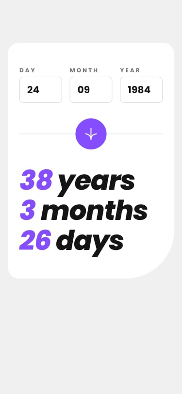

# Frontend Mentor - Age calculator app solution

This is a solution to the [Age calculator app challenge on Frontend Mentor](https://www.frontendmentor.io/challenges/age-calculator-app-dF9DFFpj-Q). Frontend Mentor challenges help you improve your coding skills by building realistic projects. 

## Table of contents

- [Overview](#overview)
  - [The challenge](#the-challenge)
  - [Screenshot](#screenshot)
  - [Links](#links)
- [My process](#my-process)
  - [Built with](#built-with)
  - [What I learned](#what-i-learned)
  - [Continued development](#continued-development)
  - [Useful resources](#useful-resources)
- [Author](#author)
- [Acknowledgments](#acknowledgments)

**Note: Delete this note and update the table of contents based on what sections you keep.**

## Overview

### The challenge

Users should be able to:

- View an age in years, months, and days after submitting a valid date through the form
- Receive validation errors if:
  - Any field is empty when the form is submitted
  - The day number is not between 1-31
  - The month number is not between 1-12
  - The year is in the future
  - The date is invalid e.g. 31/04/1991 (there are 30 days in April)
- View the optimal layout for the interface depending on their device's screen size
- See hover and focus states for all interactive elements on the page
- **Bonus**: See the age numbers animate to their final number when the form is submitted

### Screenshot

 





### Links

- Solution URL: [Add solution URL here](https://github.com/Ralphdany/Age-Calculator-App-Main.git)
- Live Site URL: [Add live site URL here](https://ralphdany.github.io/Age-Calculator-App-Main/)

## My process

### Built with

- Semantic HTML5 markup
- CSS custom properties
- Flexbox
- JS date object and date methods 


### What I learned

This is a snippet of what I actually learned while doing this project.

```js
const fullDate = new Date();
let currYear = fullDate.getFullYear();
let currMonth = fullDate.getMonth() + 1;
let currDay = fullDate.getDate();

```


### Continued development

I think I will continue my coding journey learning JS more deeply and mainly focusing on JS DOM , Events , Objects,  Asynchronous JS ...


### Useful resources

- [Example resource 1](https://www.w3schools.com) - This helped me to understand JS Date and Date methods. I really liked this pattern and will use it going forward.


## Author


- Frontend Mentor - [@Ralphdany](https://www.frontendmentor.io/profile/Ralphdany)


## Acknowledgments

I will like to thank @KingaWoch (Github) for his/her solution which really helped me to finish this project.

